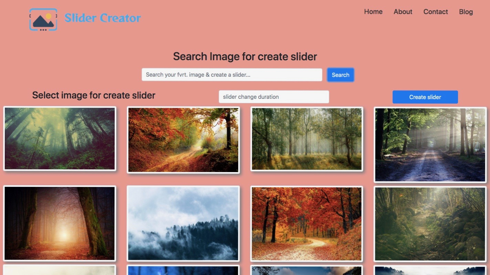

# Image-slider
## Details...
* This is a slider cretor website . you can search your fvrt image & can make a slider very easily ...

## How this site works...
* This is a sample of a slider cretor website.
* You can search your fvrt image and can easily make a slider.
* Put your image name and click 'Search' or hit the 'Enter' key of your machine.
  - if your search spell is wrong . than you will get an error message.
  - if your image box is blank than you will get an error message.
* After showing your fvrt image. select your image for slider 
  - you can also add timer for your slider, if you not set your timer it take auto 1sec.
    - if you try to add time as a negative number than you will get an error message.

## Technology...
+  JavaScript
+  CSS
+  HTML

### Click below for checkout your fvrt. image & make a slider...
[CLICK ME](https://shahinuralambhuiyan.github.io/Image-slider/)

## Let's take a look!

### Search image..
api link: https://pixabay.com/api/?key=${KEY}=${query}&image_type=photo&pretty=true
